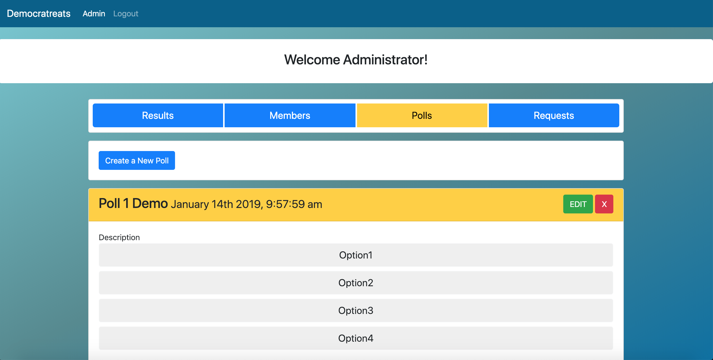
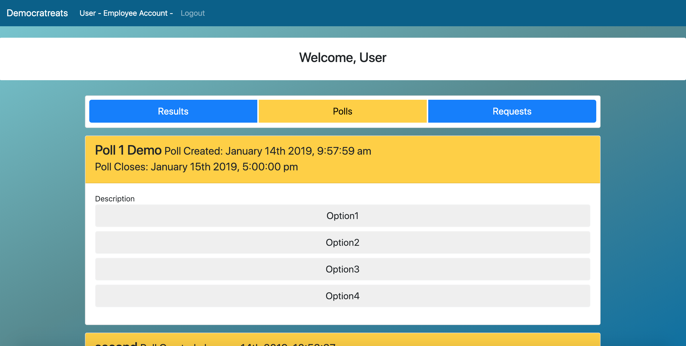
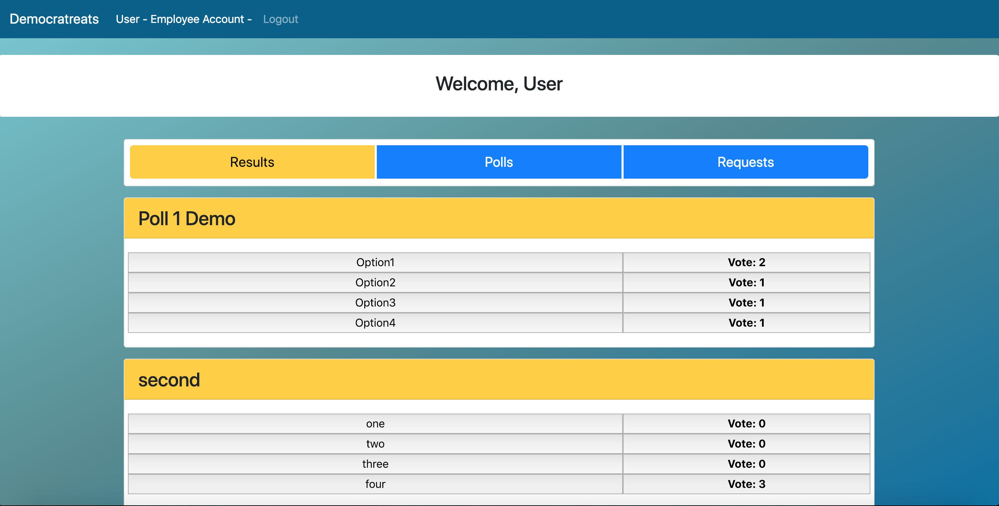

# democratreats
Bringing Ancient Greek politics to the office

## What

Democratreats is a polling web app designed to help offices make decisions, whether it's a global change or a simple snack suggestion. This allows office administrators to create polls that employees can vote on, and gives everyone a platform to drop a suggestion.

## Tech

```
Node.js,
Handlebars.js,
Passport.js,
Moment.js,
Sequelize,
API routes

```
 
## How

THE EMPLOYEE - 
*creates an account*

*suggests an item*

*joins a poll*

*votes on items*

*sees the final result*

THE ADMIN - 
*creates an account*

*reviews employee suggestions*

*creates a poll with certain parameters*

*reviews poll answers*

*finalizes and publishes results*

## Exactly How

There are be two kinds of accounts that can be created with different privileges: admin accounts, and employee accounts. Admins have full CRUD functionality regarding polls. Employees can vote in open polls and view their poll's final result. Employees can also create requests to suggest certain items they want in the office. Once a poll is closed, everyone is be able to see the winning result of the poll, yet only admins may see the current vote totals. The polls are open for voting until a set date that is determined by the admin when they create the poll. Employees can see when the poll closes so they know how long they have to submit a vote. Built-in user authentication enables new accounts to be created and signed into. A database with several tables handles all the poll data, and voting records.

## Admin Account View



## User Account View



## Display Vote Results




## Why

Democratreats makes an easy-to-use space for community input to build a healthy, active culture and make decisions with transparency. We the creators want to promote the democratic process while giving options to communicate with peers and leadership.

## Challenges

Not every project turns out exactly according to plan, and this is no exception. Building a relational database with user authentication is no easy feat at first attempt. Making sure the tables were constructed and joined to correctly track user information and poll data took some time, but was an illuminating process. Giving admin users full ability to create, read, update, and delete polls was a whole other ordeal that only with time and effort were we able to complete. Sometimes, our knowledge of git was tested as we navigated our way through merging branches and keeping a rigorous eye on the current build at hand.

## Stretch Goals

Ideas for improvement: give all accounts a private chat feature to communicate with another user, plus access to a public forum. These are our top two candidates for future functionality, as they would realize the platform's intended goal to open up an effective communication outlet. Other possible additions include a comprehensive user profile which can specify a user's function in the community. Is this user a core member of a certain team? Is this admin an HR representative of a certain branch? These questions and others are answered with a more robust account for each user.

## Contributors

Wiley Buchanan,
Jordan Larios,
Andrew Smyth,
Ritesh 
